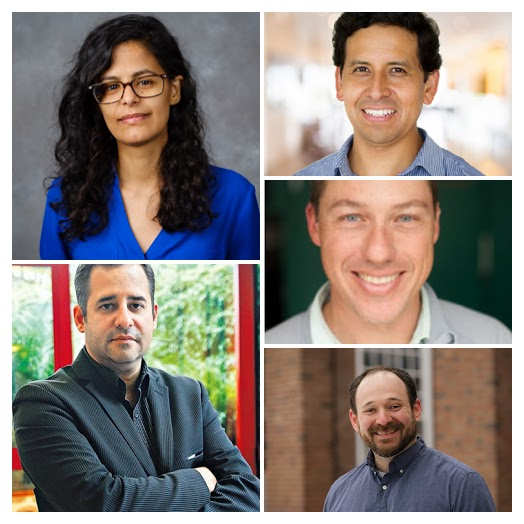
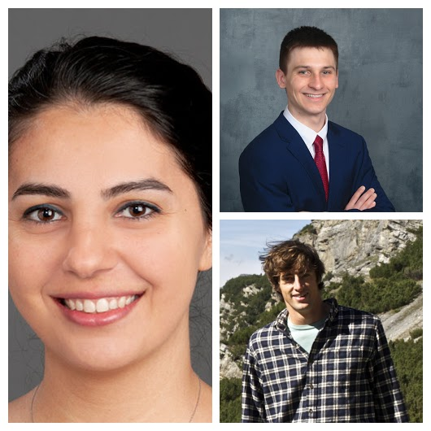
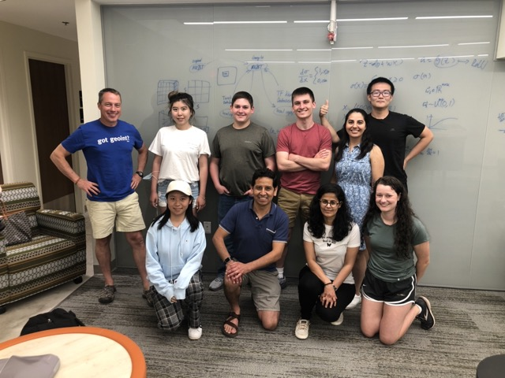

## Wake Forest IRSC Lab

Wake Forest's Intelligent Remote Sensing in Conservation & Discovery Group (IRSC Lab) is an interdisciplinary group of researchers from Wake Forest's Biology and Computer Science departments in collaboration with researchers and conservationists at Dartmouth College and [The Center for Amazonian Scientific Innovation](https://cincia.wfu.edu/en/) in Peru. Our lab works on methods to apply machine learning, artificial intelligence, and statistics to the problems of conservation in the Peruvian Amazon and around the world.

-------------------------
### [News](news.md)

<!--- Begin News Feed Slideshow --->

  <a href="/members#faculty" style="text-decoration: none;">
    
1 / 4

    
    
Meet our faculty!

  </a>

  <a href="/members#researchers" style="text-decoration: none;">
    
2 / 4

    
    
Meet our researchers!

  </a>

  <a href="/members#student-research-team" style="text-decoration: none;">
    
3 / 4

    
    
Meet our student research team!

  </a>

    
4 / 4

    
    
Our Summer Kick Off Social!

<a class="prev" onclick="plusSlides(-1)">&#10094;</a>
<a class="next" onclick="plusSlides(1)">&#10095;</a>

 

   
   
  
  

<!--- End News Feed Slideshow --->

-------------------------
### [Research](research.md)
Our lab explores novel methods and applications for computational technology to the fields of conservation and ecology. We explore questions such as

* Accurate satellite and drone image segmentation
* Large-scale object identification
* Time series analyses of mining regions
    * Change detection
    * Predicting new mining activity

* Data fusion techniques
    * Methods for combining data from different sources
    * Methods for generalizing models to different sources

* Statistical analyses of regions
    * Object significance
    * Relationships with environmental significance

* High performance computing solutions
    * Methods that leverage computation for better results
    * Efficient methods that are accessible and open source for researchers without a computer science background

* Software development
    * Software design to integrate machine learning models and predictions

-------------------------
### [Projects](projects.md)
Coming Soon!

-------------------------
### [Publications](publications.md)
Here are some of the lab's recent publications!

- Ashley Peake, Joe McCalmon, Yixin Zhang, Daniel Myers, Sarra Alqahtani, Victor Paúl Pauca, "Deep Reinforcement Learning for Adaptive Exploration of Unknown Environments", the IEEE International Conference on Unmanned Aircraft Systems, (ICUAS '21).

- Yixin Zhang, Joe McCalmon, Ashley Peake, Sarra Alqahtani, Victor Paúl Pauca, "A Symbolic-AI Approach for UAV Exploration Tasks", the 8th International Conference on Automation, Robotics and Applications (ICARA 2021), accepted.

- Xiaotian Liu, Pengyi Shi, TongTong Liu, Sarra Alqahtani, Victor Paúl Pauca, and Miles Silman, "Robustness-Driven Exploration with Probabilistic Metric Temporal Logic", the 13th International Conference on Agents and Artificial Intelligence (ICAART 2021).

- Ashley Peake\*, Joe McCalmon\*, Yixin Zhang, Benjamin Raiford, and Sarra Alqahtani, "Wilderness Search and Rescue Missions using Deep Reinforcement Learning," IEEE International Symposium on Safety, Security, and Rescue Robotics (SSRR), 2020.

- Camalan, S.; Cui, K.; Pauca, V.P.; Alqahtani, S.; Silman, M.; Chan, R.; Plemmons, R.J.; Dethier, E.N.; Fernandez, L.E.; Lutz, D.A. Change Detection of Amazonian Alluvial Gold Mining Using Deep Learning and Sentinel-2 Imagery. Remote Sens. 2022, 14, 1746. https://doi.org/10.3390/rs14071746

-------------------------
### [Contact](contact.md)
Coming Soon!
